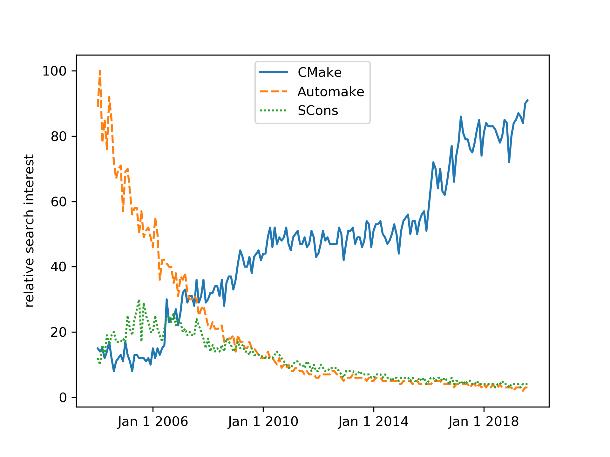

name: inverse
layout: true
class: center, middle, inverse

---

# Introduction to CMake

.author[Roberto Di Remigio]

.institution[UiT - The Arctic University of Norway]

.institution[Department of Chemistry - Virginia Tech]

.date[14 August 2019, Blacksburg]

.footnote[[CC BY 4.0](https://creativecommons.org/licenses/by/4.0/) licensed.
Browse slides at [http://tinyurl.com/cmake-tutorial-MolSSI](http://tinyurl.com/cmake-tutorial-MolSSI)]

???

---
layout: false

## Why CMake?

- Build system _generator_ (`cmake`)
- Cross-platform
- Language-agnostic
- Test orchestration (`ctest`)
- Packaging (`cpack`)
- Test reporting (`cdash`)

---

## _De facto_ standard

.footnote[Data downloaded from https://trends.google.com on 2019-08-10.]

---

## What is CMake?

---

## Where to find more details

- The CMake online documentation [https://cmake.org/cmake/documentation](https://cmake.org/cmake/documentation)
- Craig Scott [**Professional CMake**](https://crascit.com/professional-cmake/)
- Radovan Bast and I [**CMake Cookbook**](https://www.packtpub.com/application-development/cmake-cookbook)
- The CMake Cookbook [GitHub repo](https://github.com/dev-cafe/cmake-cookbook)

---

## Hands-on exercises

Prerequisites:
- Working C, C++, and Fortran compilers
- The Make and Ninja build tools
- A fork of [robertodr/cmake-tutorial](git@github.com:robertodr/cmake-tutorial.git)

Exercises:
1. Build a source file into an executable ([code]()).
2. Build library and executable for a project with dependencies ([code]()). 
3. Mixed-language projects and testing ([code]()).
4. More on unit testing with [Catch2](https://github.com/catchorg/Catch2) ([code]()).
